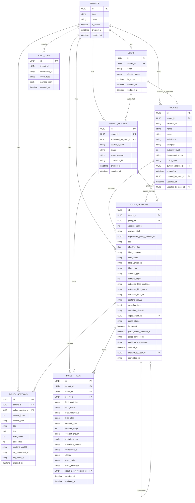

# Database schema (visual)

This document reflects the canonical SQLAlchemy models under `packages/db/models/`.

## ER diagram (Mermaid)

## Notes
- `POLICIES.current_version_id -> POLICY_VERSIONS.id` is nullable and uses `ON DELETE SET NULL`.
- `AUDIT_LOGS.tenant_id` is a tenant discriminator but is not modeled as an explicit FK in `packages/db/models/governance.py`.
- The diagram focuses on core fields + relationships; it omits many indexes/constraints for readability.
